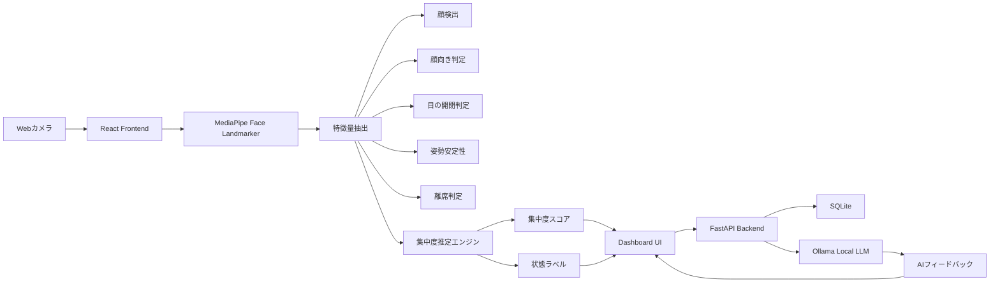

# AI集中度トラッカー 開発企画・技術設計書

## 1. プロジェクト概要

### プロジェクト名

AI Focus Tracker

### 概要

AI Focus Trackerは、Webカメラ映像からユーザーの状態を解析し、学習中・作業中の集中度をリアルタイムで推定するアプリケーションである。

顔の検出、顔の向き、目の開閉、姿勢の安定性、離席状態などをもとに集中度スコアを算出し、ユーザーに現在の集中状態を可視化する。

また、ローカルLLMであるOllamaを利用し、集中度ログをもとに学習状況のフィードバックや改善アドバイスを生成する。

---

## 2. 開発目的

本プロジェクトの目的は、ディープラーニング・画像処理・ローカルLLMを組み合わせた実用的なAIアプリケーションを開発し、GitHub上でポートフォリオとして公開できる完成度を目指すことである。

特に以下を重視する。

- Webカメラを用いたリアルタイムAI解析
- 顔情報を利用した集中度推定
- ローカルLLMによる学習フィードバック生成
- Reactによる見やすいダッシュボードUI
- GitHubで説明しやすいシステム構成

---

## 3. 想定ユーザー

- 自宅で勉強する学生
- リモートワークを行う社会人
- ポモドーロ学習を行うユーザー
- 自分の集中状態を可視化したい人
- 学習ログを分析したい人

---

## 4. システムのアイデア

このシステムでは、ユーザーがPCの前で勉強・作業している状態をWebカメラで取得する。

取得した映像からMediaPipe Face Landmarkerを用いて顔の特徴点を抽出し、以下の情報を分析する。

- 顔が検出されているか
- 顔が正面を向いているか
- 目が開いているか
- 顔や姿勢が安定しているか
- 離席していないか

これらの情報を数値化し、0〜100点の集中度スコアとして表示する。

さらに、一定時間ごとの集中度ログをバックエンドに保存し、セッション終了時にOllamaへ送信することで、ローカルLLMが学習状況に対するコメントを生成する。

---

## 5. システム全体構成



---

## 6. 使用技術

### 6.1 フロントエンド

#### React

UI構築に使用する。

主な用途:

- カメラ映像の表示
- 集中度スコアの表示
- 状態ラベルの表示
- グラフやセッション結果の表示

公式ドキュメント:

https://react.dev/

#### TypeScript

型安全なフロントエンド開発のために使用する。

主な用途:

- コンポーネントの型定義
- APIレスポンスの型定義
- 集中度ログのデータ型定義

公式ドキュメント:

https://www.typescriptlang.org/docs/

#### Tailwind CSS

UIデザインに使用する。

主な用途:

- ダッシュボード画面
- スコアカード
- ボタン
- レスポンシブデザイン

公式ドキュメント:

https://tailwindcss.com/docs

---

### 6.2 AI・画像解析

#### MediaPipe Face Landmarker

顔検出・顔ランドマーク取得に使用する。

主な用途:

- 顔検出
- 顔の特徴点取得
- 目の開閉判定
- 顔向き推定
- 表情情報の取得

公式ドキュメント:

https://ai.google.dev/edge/mediapipe/solutions/vision/face_landmarker/web_js

#### OpenCV

必要に応じて画像処理補助に使用する。

主な用途:

- 画像前処理
- フレーム処理
- 顔位置の補助的な解析

公式ドキュメント:

https://docs.opencv.org/

---

### 6.3 バックエンド

#### FastAPI

バックエンドAPIの作成に使用する。

主な用途:

- 集中度ログの受信
- セッション管理
- Ollamaとの連携
- SQLiteへの保存

公式ドキュメント:

https://fastapi.tiangolo.com/

#### Pydantic

FastAPIで受け取るデータの型定義・バリデーションに使用する。

公式ドキュメント:

https://docs.pydantic.dev/

---

### 6.4 ローカルLLM

#### Ollama

ローカル環境でLLMを動作させるために使用する。

主な用途:

- 集中度ログの要約
- 学習状況の分析
- 改善アドバイス生成
- セッション終了時のフィードバック生成

公式ドキュメント:

https://docs.ollama.com/

Ollama API:

https://docs.ollama.com/api

使用候補モデル:

- qwen2.5:7b
- llama3.1:8b
- gemma3
- mistral

---

### 6.5 データベース

#### SQLite

ローカル環境で集中度ログを保存するために使用する。

主な用途:

- セッション情報の保存
- 集中度スコアの保存
- AIフィードバックの保存

公式ドキュメント:

https://www.sqlite.org/docs.html

---

## 7. 開発する機能

### 7.1 MVP機能

#### カメラ映像表示

Webカメラを起動し、ブラウザ上に映像を表示する。

#### 顔検出

MediaPipeを使い、ユーザーの顔が検出されているか判定する。

#### 顔向き判定

顔が正面を向いているか、横を向いているかを判定する。

#### 目の開閉判定

目が開いているか、閉じているかを判定する。

#### 離席判定

一定時間顔が検出されない場合、離席状態として扱う。

#### 集中度スコア表示

顔検出、顔向き、目の開閉、安定性などから0〜100点の集中度スコアを算出して表示する。

#### 状態ラベル表示

集中度スコアに応じて以下の状態を表示する。

- 集中
- やや集中
- 注意散漫
- 離席

#### 集中度ログ保存

一定間隔で集中度スコアを保存する。

#### AIフィードバック生成

セッション終了時に集中度ログをOllamaに送信し、学習状況のコメントを生成する。

---

### 7.2 追加機能

#### 集中度グラフ

時間ごとの集中度変化を折れ線グラフで表示する。

#### セッション履歴

過去の学習・作業セッションを一覧表示する。

#### ポモドーロタイマー

25分集中・5分休憩などのタイマーを追加する。

#### CSV出力

集中度ログをCSV形式で出力する。

#### AI学習レポート

セッション終了後に以下を表示する。

- 平均集中度
- 最大集中度
- 集中低下回数
- 離席時間
- 改善アドバイス

---

## 8. 集中度スコア設計

### スコア計算例

| 項目 | 点数 |
|---|---:|
| 顔が検出されている | 30 |
| 顔が正面を向いている | 25 |
| 目が開いている | 20 |
| 顔・姿勢が安定している | 15 |
| 離席していない | 10 |
| 合計 | 100 |

### 状態分類

| スコア | 状態 |
|---:|---|
| 80〜100 | 集中 |
| 60〜79 | やや集中 |
| 40〜59 | 注意散漫 |
| 0〜39 | 離席・集中低下 |

---

## 9. データ設計

### 集中ログデータ例

```json
{
  "timestamp": "2026-05-19T18:30:00",
  "session_id": 1,
  "focus_score": 78,
  "eye_open_score": 0.82,
  "head_pose_score": 0.74,
  "stability_score": 0.69,
  "face_detected": true,
  "status": "やや集中"
}
```

### セッションデータ例

```json
{
  "session_id": 1,
  "start_time": "2026-05-19T18:00:00",
  "end_time": "2026-05-19T18:30:00",
  "average_focus_score": 76,
  "max_focus_score": 92,
  "low_focus_count": 5,
  "absence_time": 180,
  "ai_feedback": "前半は安定して集中できていましたが、後半に集中度が低下しています。次回は25分ごとに休憩を入れると良いです。"
}
```

---

## 10. API設計

### セッション開始

```http
POST /api/session/start
```

### 集中ログ保存

```http
POST /api/focus-log
```

### セッション取得

```http
GET /api/session/{session_id}
```

### セッション一覧取得

```http
GET /api/sessions
```

### AIフィードバック生成

```http
POST /api/session/{session_id}/summary
```

---

## 11. ディレクトリ構成案

```txt
focus-tracker-ai/
├─ frontend/
│  ├─ src/
│  │  ├─ components/
│  │  │  ├─ CameraView.tsx
│  │  │  ├─ FocusScoreCard.tsx
│  │  │  ├─ StatusLabel.tsx
│  │  │  ├─ SessionTimer.tsx
│  │  │  └─ FocusGraph.tsx
│  │  ├─ hooks/
│  │  │  ├─ useCamera.ts
│  │  │  └─ useFaceLandmarker.ts
│  │  ├─ utils/
│  │  │  ├─ focusCalculator.ts
│  │  │  └─ apiClient.ts
│  │  ├─ types/
│  │  │  └─ focus.ts
│  │  └─ App.tsx
│  └─ package.json
│
├─ backend/
│  ├─ main.py
│  ├─ models.py
│  ├─ database.py
│  ├─ focus_engine.py
│  ├─ ollama_client.py
│  └─ requirements.txt
│
├─ docs/
│  ├─ project_overview.md
│  ├─ system_design.md
│  └─ architecture.md
│
├─ README.md
└─ docker-compose.yml
```

---

## 12. 開発スケジュール

### 1週間で作る場合

| 日数 | 内容 |
|---|---|
| Day 1 | React環境構築、カメラ表示 |
| Day 2 | MediaPipe Face Landmarker導入 |
| Day 3 | 顔検出・顔向き・目の開閉判定 |
| Day 4 | 集中度スコア計算、状態ラベル表示 |
| Day 5 | FastAPI・SQLite連携 |
| Day 6 | Ollama連携、AIコメント生成 |
| Day 7 | README作成、デモ動画、GitHub公開 |

### 2週間で作る場合

#### Week 1

- MVP開発
- カメラ表示
- 顔解析
- 集中度推定
- 基本UI

#### Week 2

- ログ保存
- グラフ表示
- Ollamaフィードバック
- README整備
- デモGIF作成
- GitHub公開

---

## 13. GitHubで見せるポイント

READMEには以下を記載する。

- プロジェクト概要
- デモGIF
- 技術スタック
- システム構成図
- セットアップ方法
- 使用方法
- 集中度スコアの計算方法
- 今後の拡張予定

---

## 14. 今後の拡張案

- 姿勢推定の追加
- スマホ使用検出
- 音声による集中環境分析
- Electron化によるデスクトップアプリ化
- Google Calendar連携
- 学習時間の自動記録
- 学習内容ごとの集中度分析
- ローカルLLMによる日次レポート生成

---

## 15. 参考ドキュメント一覧

### React

https://react.dev/

### React TypeScript

https://react.dev/learn/typescript

### TypeScript

https://www.typescriptlang.org/docs/

### Tailwind CSS

https://tailwindcss.com/docs

### MediaPipe Face Landmarker

https://ai.google.dev/edge/mediapipe/solutions/vision/face_landmarker/web_js

### OpenCV

https://docs.opencv.org/

### FastAPI

https://fastapi.tiangolo.com/

### Pydantic

https://docs.pydantic.dev/

### Ollama

https://docs.ollama.com/

### Ollama API

https://docs.ollama.com/api

### SQLite

https://www.sqlite.org/docs.html

---

## 16. MVP完成条件

以下が実装できればMVP完成とする。

- Webカメラが起動する
- 顔検出ができる
- 顔向き・目の開閉を判定できる
- 集中度スコアを表示できる
- 状態ラベルを表示できる
- 集中度ログを保存できる
- Ollamaで学習フィードバックを生成できる

---

## 17. このプロジェクトの強み

このプロジェクトは、画像処理AI、リアルタイム解析、ローカルLLM、Webアプリ開発を組み合わせた実用的なAIアプリケーションである。

短期間で開発可能でありながら、GitHub上で以下の点をアピールできる。

- AIを用いたリアルタイム解析
- ローカルLLMの活用
- フロントエンドとバックエンドの連携
- データ保存と分析
- 学習支援アプリとしての実用性
